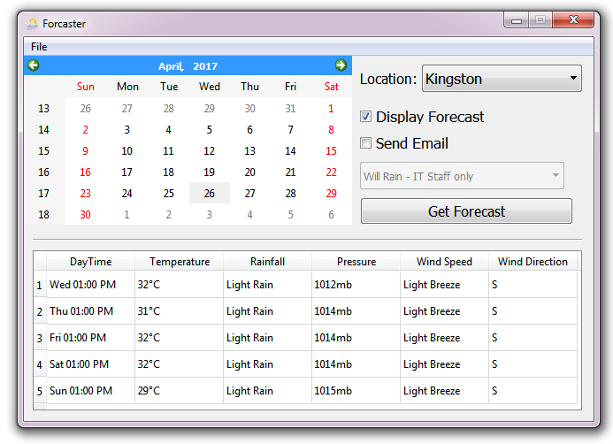

# The Problem

# Requirements 
* Python 3.x
* BeautifulSoup
* PyQt4
* SQLite Manager (optional)

# Installation
```
$ pip install beautifulsoup4
$ pip install texttable
```

# Execution 

1. Clone this repo
```
```

2. Run Driver.py
```
$ python Driver.py
```

# UPDATES
There is now a basic GUI for this application:


This program now supports more than just Kingston and Montego Bay. 
See newly supported locations below:
* Kingston, Spanish Town, Portmore, Morant Bay
* Port Antonio, Port Maria, Ocho Rios, Falmouth
* Montego Bay, Negril, Savanna-la-mar, Santa Cruz
* Mandeville, May Pen
